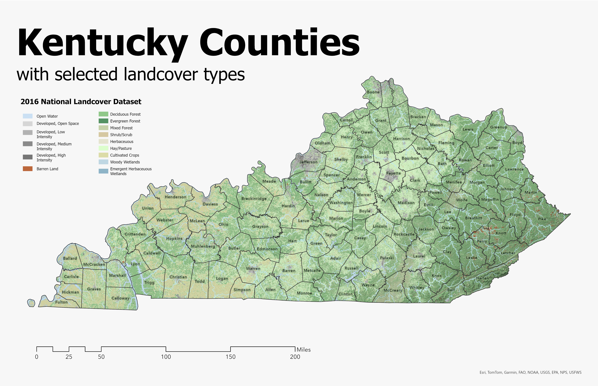
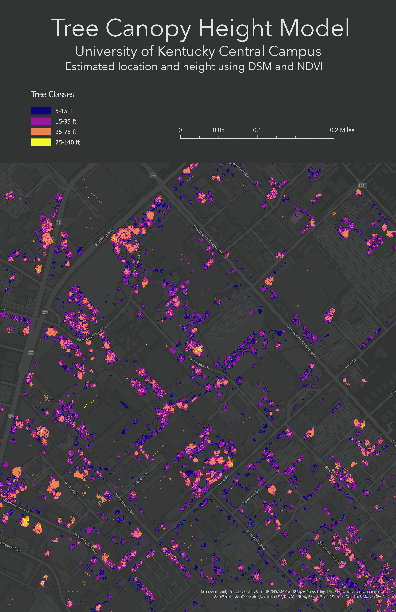

# geo-409
[my first link](https://abbymn.github.io/geo-409/)

Kentucky counties with selected landcover types - [Download geospatial PDF](ky-landuse.pdf)

UKY Central Campus canopy model - [Download geospatial PDF](Layout.pdf)

Maps creates by abbymn for GEO 409.
